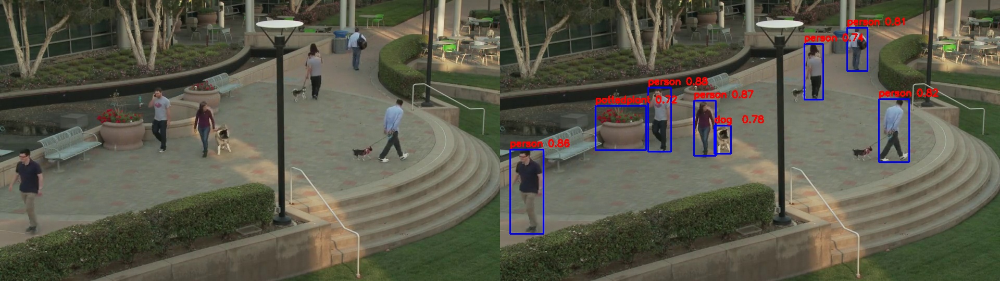

# devTools
some small tools developed while coding

## orin_opencv_gstreamer
使用开启了gstreamer的opencv读取rtsp视频流，在Orin能够明显加速，减少视频帧延迟问题。但直接`apt install`或`pip3 install`的OpenCV默认都不带gstreamer，需要自行源码编译。

## PickColor
看rgb颜色的，开发界面时经常用，本来写了个数字-颜色转换的小工具，写完后发现Qt已经有了。。。

## rpcDemo
使用　[RPCLIB](https://github.com/rpclib/rpclib.git)　通信，主要用于控制AirSim仿真环境以获取数据进行三维重建。

## videowriter
使用OpenCV写视频，但有些视频能正常打开，有些则在windows下异常。DeepSeek说是编码问题，h264编码支持更广泛，但写入时不是h264

## defeatDetection
缺陷检测神经网络模型 

## imageProcessPy
图像预处理

## StreamDetectionDemo
使用gstream加速rtsp视频帧读取，使用yolo检测。

